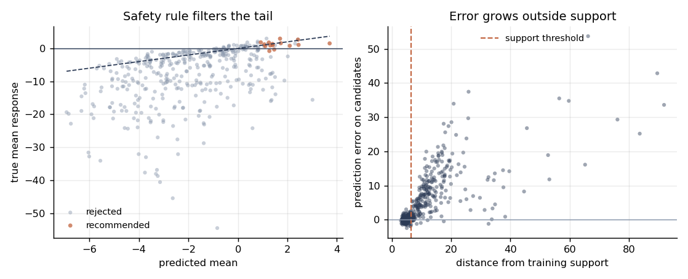
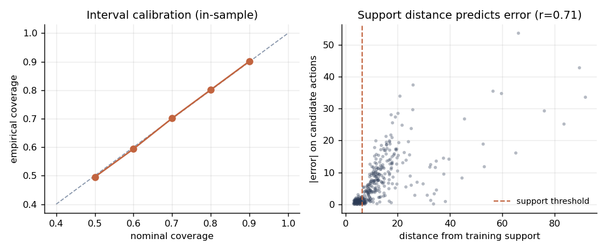
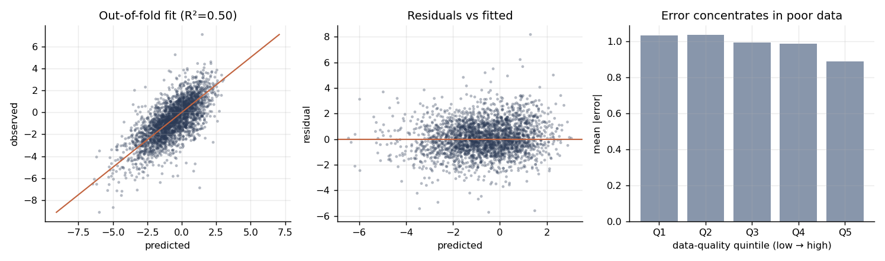

# Surrogate Modelling for Industrial Setpoint Optimisation

Building a response-surface model that is safe enough to drive real equipment.

An industrial site runs a fleet of production assets. Each has three controllable
setpoints. When an operator changes them, the change in output is measured over the
next 48 hours. The goal is a **surrogate model** of

```
f(state, action) -> Δ output over 48h
```

so candidate setpoint changes can be scored *before* being applied to physical plant.

The interesting part is not the regression. It is that **ranking candidate actions by
predicted mean is actively harmful**, and this repo quantifies exactly how harmful.

> **Data note.** Everything here runs on a synthetic dataset generated by
> [`src/generate.py`](src/generate.py) — no proprietary or client data. The generator
> is documented, seeded, and deliberately built with the pathologies that make the
> real version of this problem hard. `git clone`, `python run_analysis.py`, and every
> number below reproduces exactly.

---

## Headline result

Scoring 400 candidate actions with the same model, changing only the decision rule:

| Policy | Selected | True mean response | True worst case | Actually harmful |
|---|---:|---:|---:|---:|
| Naive — top 20 by predicted mean | 20 | **−3.38** | **−15.65** | **9 / 20** |
| Safe rule — top 20 by lower confidence bound | 15 | **+1.22** | **−0.78** | **2 / 15** |

The naive policy is not merely suboptimal — it is **net negative**, and nearly half its
picks damage production. Same model, same predictions. Only the ranking rule changed.

The reason: the highest predicted means sit exactly where the model is least
constrained by data. The surrogate extrapolates confidently into action ranges no
operator ever tried, and nothing in the training data contradicts it.



---

## What the repo demonstrates

### 1. Validation design decides whether you are fooling yourself

Assets carry persistent latent characteristics (completion design, tubing condition,
local constraints). Random k-fold puts the *same asset* in train and test, so the model
scores well by recognising the asset rather than learning the response function.

| Scheme | MAE | RMSE | R² |
|---|---:|---:|---:|
| Random k-fold (leaky) | 0.941 | 1.225 | **0.546** |
| Grouped by asset | 0.986 | 1.290 | **0.497** |
| Forward in time | 0.954 | 1.244 | 0.544 |

Random k-fold overstates R² by ~5 points. On a fleet with fewer assets or stronger
asset effects the gap widens sharply. Grouped CV answers *"will this work on an asset we
have not modelled?"* — the only question that matters at deployment.

For reference, the **oracle R² ceiling is 0.811**: even the true response function
cannot explain more, because measurement noise is irreducible. Reporting a ceiling
alongside the score turns "R² = 0.50" from a mediocre-sounding number into
"we captured ~61% of the learnable signal."

### 2. Uncertainty has to be calibrated, not just produced

Gradient-boosted quantile heads are systematically over-tight — they inherit the
optimism of the data they were fitted on. Raw 80% intervals covered ~73%. A single
scalar **split-conformal correction**, measured on held-out *assets*, fixes it:

```
80% interval coverage (out-of-fold): 0.797   (nominal 0.800)
```



### 3. A negative result worth reporting

The design assumed a bagged ensemble would flag model ignorance. Measured against
actual error, it barely does:

| Signal | Correlation with \|error\| |
|---|---:|
| Ensemble disagreement, in-distribution | 0.03 |
| Ensemble disagreement, on candidates | 0.16 |
| **k-NN distance to training support, on candidates** | **0.71** |

Ensemble disagreement is widely treated as *the* epistemic uncertainty estimate. Here a
plain distance-to-training-data check was ~4.5× more informative. The ensemble is kept
because it is cheap and feeds the total-variance term, but the support check is what
makes the safety rule work. This is in the README rather than quietly dropped because
the failed hypothesis is more useful than the tidy story.

### 4. Diagnostics that check the assumptions, not just the fit



Error concentrates in low-quality records exactly as the noise model implies — which is
why records are **weighted by data quality rather than discarded**. Dropping them loses
real signal; trusting them equally lets measurement noise masquerade as process
behaviour.

---

## The safety rule

A candidate is recommended only if it clears every gate:

| Gate | Rejects |
|---|---:|
| No confident expected gain (LCB ≤ 0) | 364 |
| Downside risk below tolerance | 333 |
| Action outside historical envelope | 269 |
| State–action pair unlike training data | 257 |
| Action magnitude too large | 232 |

**15 of 400 candidates survive.** A recommender that declines to answer 96% of the time
sounds broken until you look at what it declined — the rejected set contains the
−15.7 outcome the naive policy selected.

Ranking uses a lower confidence bound rather than the mean:

```
LCB = predicted_mean − κ · sqrt(aleatoric² + epistemic²)
```

`κ` is exposed rather than tuned. It encodes how expensive an unplanned shutdown is
relative to a marginal production gain — a business decision, not a statistical one.

### Which part actually does the work

Sweeping `κ` separates the contribution of the guardrails from the contribution of the
uncertainty penalty:

| κ | Recommended | True mean | True worst case | Harmful |
|---:|---:|---:|---:|---:|
| 0.0 | 25 | 1.31 | −0.78 | 2 |
| 0.5 | 22 | 1.31 | −0.78 | 2 |
| 1.0 | 15 | 1.22 | −0.78 | 2 |
| 1.5 | 7 | 1.66 | **+0.81** | **0** |
| 2.0 | 3 | 1.67 | **+0.81** | **0** |
| 3.0 | 0 | — | — | 0 |

At **κ = 0** — no uncertainty penalty at all — the policy already returns +1.31 against
the naive −3.38. So **the hard gates (support check, action envelope, downside tolerance)
carry most of the benefit; the LCB penalty is a refinement**, not the main mechanism. It
earns its place between κ = 1.0 and 1.5, where the worst case crosses into positive
territory and the last harmful picks are eliminated — at the cost of two thirds of the
candidate pool.

Stating this because the tidier story would be "use a lower confidence bound." The
measurement says the support check matters more.

---

## A second pass: the small-sample regime

[`notebooks/02_small_sample_surrogate_analysis.ipynb`](notebooks/02_small_sample_surrogate_analysis.ipynb)
re-runs the same problem with **320 events across 12 assets** instead of 2600 across 24 —
the size industrial datasets actually arrive in. Sample size changes which methods are
correct, and the notebook is structured as a full analysis: EDA → validation design →
baseline → model ablation → uncertainty → diagnostics → candidate scoring → summary.

What changes at small n:

- **A single split becomes uninterpretable.** With 12 assets, fold-to-fold R² swings so
  widely that the headline has to be a repeated 5-fold GroupKFold mean ± spread. Quoting one
  split — in either direction — is quoting noise.
- **Model choice has to be earned.** An ablation across the same folds picks the model;
  RandomForest wins here because the response genuinely saturates and interacts, but on
  sparser data the regularised linear model usually wins. The deliverable is the ablation,
  not the winner.
- **Uncertainty stops being decoration.** Split-conformal intervals calibrated on held-out
  *assets* give a half-width of ±1.74 against a best predicted gain of +2.88.

The recommendation funnel is the punchline:

| Rule | Candidates flagged (of 140) |
|---|---:|
| Naive "positive predicted mean" | **34** |
| Lower bound above zero | **2** |
| Clears the lower bound *and* every safety flag | **0** |

**Zero confident recommendations is the answer**, not a failure to find one. The synthetic
ground truth confirms it: a mean-ranking recommender would have shipped a top-20 whose *true*
mean response is **−2.81**, with **10 of 20 actively harmful**. The model still earns its
keep — a **75% direction hit-rate** against a 37% base rate — it just is not confident enough
to justify touching equipment without a monitored trial first.

---

## Running it

```bash
pip install -r requirements.txt
python run_analysis.py          # regenerates data, figures, metrics
```

Or work through [`notebooks/01_surrogate_modelling.ipynb`](notebooks/01_surrogate_modelling.ipynb),
which walks the same pipeline with commentary.

```
src/generate.py     synthetic generator (confounded actions, heteroscedastic noise,
                    regime interactions, saturating + reversing response)
src/features.py     physically-motivated features; quality-based sample weights
src/model.py        mean model, quantile heads, conformal calibration, grouped CV
src/recommend.py    support check, action envelope, LCB scoring, policy comparison
run_analysis.py     end-to-end run producing every number in this README
```

Runtime is ~2 minutes on a laptop. Dependencies are numpy, pandas, scikit-learn,
matplotlib, scipy — nothing exotic.

---

## Honest limitations

- **The generator is my own model of the problem.** It is informed by how these systems
  behave, but a synthetic response surface cannot prove a method works on real plant
  data. It is a demonstration of methodology, not a validation of it.
- **Confounded action selection is present but not corrected for.** Operators choose
  actions based on asset condition, so the historical data is observational, not
  experimental. The safety rule limits the damage by refusing to extrapolate, but a
  proper treatment needs either explicit causal adjustment or randomised trials.
  Distinguishing "this action helps" from "this action is applied to assets that were
  recovering anyway" is not solved here.
- **No Bayesian optimisation loop.** Scoring a fixed candidate set is deliberately the
  scope; sequential design would need an acquisition function and a live feedback path.
- **Single seed for headline numbers.** Metrics move by a few points across seeds. The
  policy comparison direction is stable; the exact magnitudes are not.

## License

MIT
